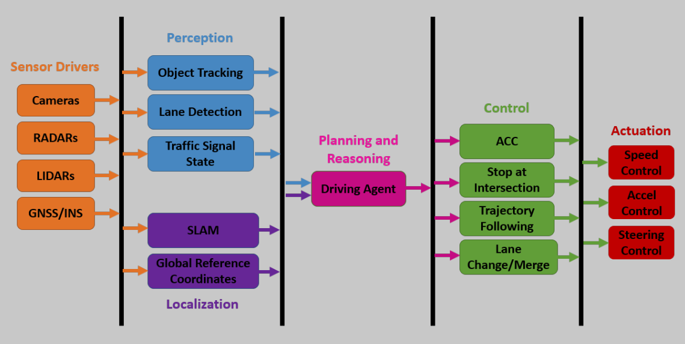

# RC_AI
## Introduction
The scope of this project is to build a modular Autonomous Vehicle Software Stack. This software stack will follow the general flowchart shown below in figure 1.
The goal is to first be able to model this project in simulation, using Unreal Engine as a physics simulator, and ROS as a robotics middle-ware software.
After this is achieved, we can test our implementation on real world hardware.

*Figure 1. Autunomous Vehicle Software Flowchart (OU-ECE6460)*
