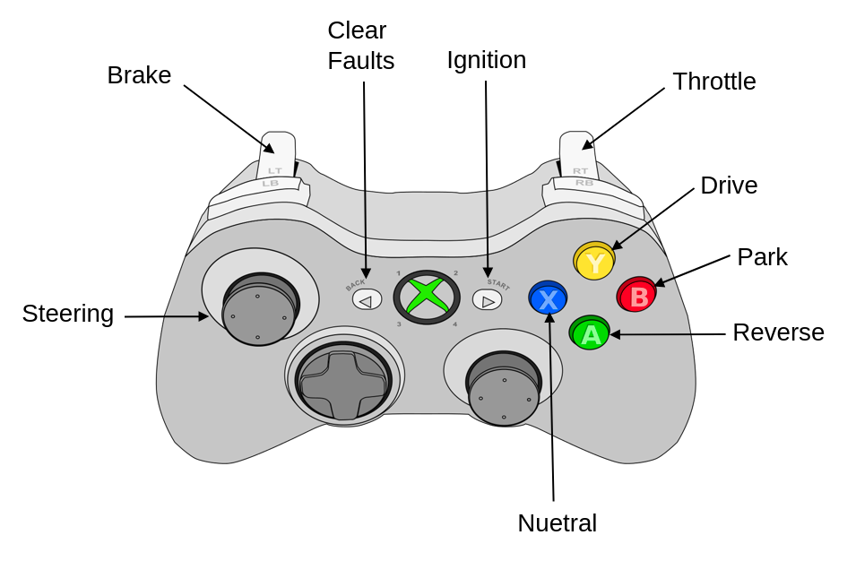

# Xbox_Driver

 **Daniel Vega** - *v.1.0.0*

This package utilizes the ROS Joy package to find a connected joystick controller, map the button inputs to vehicle commands, and publish those vehicle commands as custom message.

## Getting Started

*Note:* The contents of this package have been designed and tested for an Xbox360 controller. While other controllers may work, they are not recommended since the button mapping has not been tested.

To use this package, simply connect a wired Xbox360 controller to the computer running this node. The package will connect to the device with the port number specified in the launch file. The picture below displays the avaiable commands that can be utilized for teleop functionality. Buttons only have to be pressed once in order to change drive modes (i.e. no long press or multiple button press).



## Nodes

### xbox_joy_publisher

This node interfaces directly with the vehicle_controller package in this project. The vehicle_controller package is designed to process the specified joystick commands and produce the corresponding vehicle kinematics to drive the vehicle.

#### Subscribed Topics

* **`~/joy`** ([sensor_msgs/Joy])

  Reports the state of a joysticks axes and buttons.

#### Published Topics

* **`~/xbox_joy_cmds`** ([xbox_driver/XboxInterface])

  Custom message that remaps controller input for `/joy` topic to user friendly vehicle commands. See screenshot above. The message contains the variables listed below.
  - Reverse [bool]
  - Park [bool]
  - Neutral [bool]
  - Drive [bool]
  - ClearFaults [bool]
  - Ignition [bool]
  - Throttle [float32]
  - Brake  [float32]
  - Steering  [float32]

#### Parameters

- None


## Running the tests

Currently no tests available.


```
TBD
```


## License

This project is licensed under the MIT License - see the [LICENSE.md](LICENSE.md) file for details


[sensor_msgs/Joy]:https://docs.ros.org/en/api/sensor_msgs/html/msg/Joy.html
