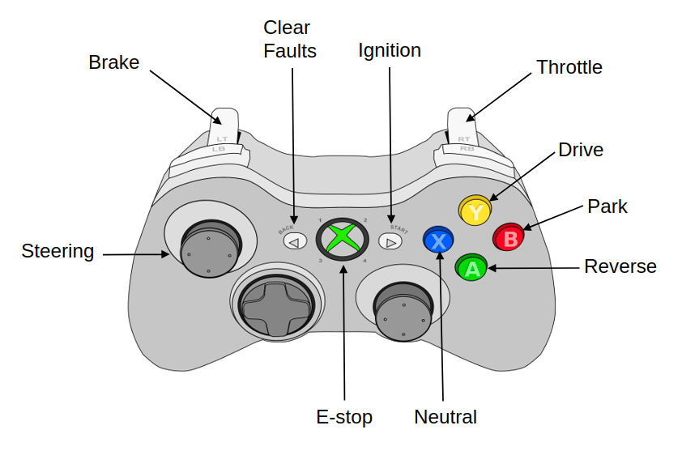

# Xbox_Driver

 **Daniel Vega** - *v.0.0.0*

This package utilizes the ROS joy package to find a connected joystick controller, map the button inputs to vehicle commands, and publish those vehicle commands as custom message.

## Getting Started

Instructions on how to use package here.



## Nodes

### Xbox_driver

These instructions will get you a copy of the project up and running on your local machine for development and testing purposes. See deployment for notes on how to deploy the project on a live system.

#### Subscribed Topics

* **`~/joy`** ([sensor_msgs/Joy])

  Reports the state of a joysticks axes and buttons.

#### Published Topics

* **`~/xbox_joy_cmds`** ([xbox_driver/XboxInterface])

  Custom message that remaps controller input for `/joy` topic to user friendly vehicle commands. See screenshot above. The message contains the variables listed below.
  - Reverse [bool]
  - Park [bool]
  - Neutral [bool]
  - Drive [bool]
  - ClearFaults [bool]
  - Ignition [bool]
  - Throttle [float32]
  - Brake  [float32]
  - Steering  [float32]

#### Parameters

Explain how to run the automated tests for this system
#Message to map


## Running the tests

Currently no tests available.


```
Give an example
```


## License

This project is licensed under the MIT License - see the [LICENSE.md](LICENSE.md) file for details


[sensor_msgs/Joy]:https://docs.ros.org/en/api/sensor_msgs/html/msg/Joy.html
